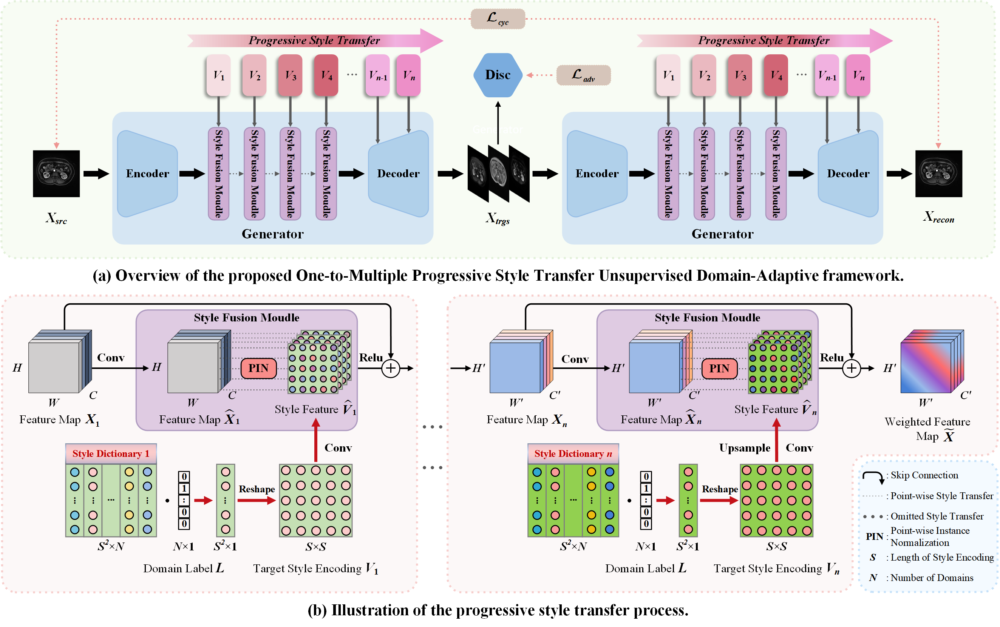

# One-to-Multiple: A Progressive Style Transfer Unsupervised Domain-Adaptive Framework for Kidney Tumor Segmentation

| **[1 Introduction](#introduction)** 
| **[2 Requirements](#requirements)**
| **[3 Usage](#usage)**
| **[4 Citation](#citation)**
| **[5 Acknowledgments](#acknowledgments)** |

<a id="introduction"></a>
## Introduction

Official code for NeurIPS 2024 paper "[One-to-Multiple: A Progressive Style Transfer Unsupervised Domain-Adaptive Framework for Kidney Tumor Segmentation]()".

> In multi-sequence Magnetic Resonance Imaging (MRI), accurately segmenting the kidney and tumor using traditional supervised methods requires detailed, labor-intensive annotations for each sequence. Unsupervised Domain Adaptation (UDA) reduces this burden by aligning cross-modal features and addressing inter-domain differences. However, most UDA methods focus on one-to-one domain adaptation, limiting efficiency in multi-target scenarios. To address this challenge, we propose a novel and efficient One-to-Multiple Progressive Style Transfer Unsupervised Domain-Adaptive (PSTUDA) framework.

<div align=center></div>

<a id="requirements"></a>
## Requirements

`python=3.7`,`torch=1.10.1+cu111`, `accelerate=0.20.3`

<a id="usage"></a>

## Usage

### Dataset Storage Format

The directory structure of our private MSKT dataset is as follows:

```
dataset/
├── data/
│   ├── case_000/
│   │   ├── t1c/
│   │   │   ├── img/
│   │   │   │   ├── img_slice008.npy
│   │   │   │   ├── img_slice009.npy
│   │   │   │   └── ...  # other slice files
│   │   │   ├── label/
│   │   │   │   ├── label_slice008.npy
│   │   │   │   ├── label_slice009.npy
│   │   │   │   └── ...  # other label files
│   │   ├── fst2w/
│   │   │   ├── img/
│   │   │   │   ├── img_slice005.npy
│   │   │   │   ├── img_slice006.npy
│   │   │   │   └── ...  # other slice files
│   │   │   ├── label/
│   │   │   │   ├── label_slice005.npy
│   │   │   │   ├── label_slice006.npy
│   │   │   │   └── ...  # other label files
│   │   ├── t2w/
│   │   │   └── ...  # structure is similar to t1c and fst2w
│   │   ├── dwi/
│   │   │   └── ...  # structure is similar to t1c and fst2w
│   ├── case_001/
│   │   └── ...  # other folder structures are similar
│   ├── case_002/
│   │   └── ...
│   └── ...
├── filter_t1c_train.txt
├── filter_fst2w_train.txt
├── filter_t2w_train.txt
└── filter_dwi_train.txt
```

Description:

The four `filter_*.txt` files index all slice files from different sequences in the `data/` directory (with filter indicating that only slices containing the target region are recorded). 
For example, each line in `filter_t1c_train.txt` records paths like `data/case_046/t1c/img/img_slice005.npy`, `data/case_046/t1c/img/img_slice006.npy`, and so on.

Though the private dataset is not publicly available, the provided dataset storage format is intended to support implementation with custom datasets.

```
python xxxx.py
```

xxxxxxxxxxxxxxxxxx: 

```
python xxx.py
python xxx.py
```
xxxxxxxxxxxxxxxxxx: 
```
python xxx.py
python xxx.py
```

<a id="citation"></a>

## Citation

If you find our work is useful for your research, please consider citing:

```
@article{hu2024one,
  title={One-to-Multiple: A Progressive Style Transfer Unsupervised Domain-Adaptive Framework for Kidney Tumor Segmentation},
  author={Hu, Kai and Li, Jinhao and Zhang, Yuan and Ye, Xiongjun and Gao, Xieping}
  journal={Advances in Neural Information Processing Systems},
  volume={},
  year={2024}
}
```

<a id="acknowledgments"></a>

## Acknowledgments

Our code is inspired by [StarGAN v2](https://github.com/clovaai/stargan-v2) and [pytorch-CycleGAN-and-pix2pix](https://github.com/junyanz/pytorch-CycleGAN-and-pix2pix).
